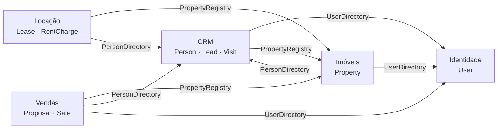

# Imobiliária API

Backend de gestão para imobiliárias: cadastro de imóveis, CRM, locação, vendas e comissões.

Cada imobiliária recebe a sua própria instalação (aplicação + banco), então não há dados de clientes diferentes no mesmo banco.

- **Stack:** Node.js 22, TypeScript, NestJS 11, Prisma ORM 7, PostgreSQL 16, Zod (nestjs-zod), Vitest, Docker
- **Arquitetura:** Clean Architecture + DDD, organizada como monólito modular
- **Documentação da API:** Swagger em `/docs` (JSON em `/docs.json`), gerado dos mesmos DTOs Zod que validam as requisições

## Como rodar

### Tudo com Docker (produção ou demonstração)

```bash
cp .env.example .env        # edite as senhas e o JWT_SECRET
docker compose up -d --build
```

O compose sobe o PostgreSQL, aplica as migrações e só então inicia a API em `http://localhost:7000` (a porta vem de `PORT` no `.env`).
No primeiro start, se o banco não tiver nenhum usuário, o administrador definido em `ADMIN_EMAIL` / `ADMIN_PASSWORD` é criado.

Para instalar para outra imobiliária, repita em outra pasta ou servidor com outro `.env` (outro `AGENCY_NAME`, senhas, `PORT`) e, se for na mesma máquina, outro nome de projeto: `docker compose -p imobiliaria-cliente2 up -d --build`.

### Desenvolvimento local

```bash
cp .env.example .env
yarn install
docker compose up -d db     # só o banco
yarn db:deploy              # aplica as migrações
yarn db:seed                # opcional: dados de demonstração (admin@demo.com.br / demo12345)
yarn dev                    # API com reload em http://localhost:7000
```

### Scripts

| Comando | O que faz |
|---|---|
| `yarn dev` | Compila em modo watch e reinicia a API a cada alteração |
| `yarn build` / `yarn start` | Gera `dist/main.js` e roda a versão compilada |
| `yarn typecheck` | Checagem de tipos |
| `yarn test` | Testes unitários e da camada HTTP (sem banco) |
| `yarn test:e2e` | Testes de ponta a ponta contra o PostgreSQL (usa o banco `<nome>_test`, criado e zerado automaticamente) |
| `yarn db:migrate` | Cria e aplica uma nova migração depois de alterar `prisma/schema.prisma` |
| `yarn db:deploy` | Aplica as migrações pendentes |
| `yarn db:studio` | Abre o Prisma Studio |

O build usa o tsup com SWC (e não o `nest build`): o SWC emite os metadados de tipo dos decorators, que o NestJS usa para validar os DTOs e montar o Swagger, e o tsup gera um único `dist/main.js` em ESM. Os testes rodam no Vitest com o mesmo SWC (`unplugin-swc`).

## Arquitetura

### Camadas

Cada módulo tem três camadas, e a dependência aponta sempre para dentro:

```
infra  ──►  application  ──►  domain
```

| Camada | O que contém | O que pode importar |
|---|---|---|
| `domain` | Entidades, agregados, objetos de valor, regras de negócio e as **interfaces** dos repositórios | Só `shared/domain` |
| `application` | Casos de uso (um por operação) e as portas de que precisam (hash de senha, token, relógio, unidade de trabalho) | `domain` e os **contratos** de outros módulos |
| `infra` | Controllers e DTOs do NestJS, repositórios Prisma, criptografia, repositórios em memória para teste | Tudo acima, mais bibliotecas |

O domínio e os casos de uso não conhecem Prisma, NestJS nem HTTP: não têm decorators. Trocar o banco ou o framework web significa reescrever a camada `infra` e os `*.module.ts`; nenhuma regra de negócio muda.

### Como o NestJS está ligado

- **Um `*.module.ts` por módulo de negócio**, importados pelo `AppModule`. O CRM tem dois: `PeopleModule` (pessoas) e `CrmModule` (leads e visitas). Imóveis, locação e vendas dependem de pessoas, e leads dependem de imóveis; num módulo só, isso seria um ciclo.
- **Injeção por tokens.** Cada interface (repositório, `UserDirectory`, `Clock`…) tem um token em `<módulo>.tokens.ts`. Os casos de uso são registrados com o helper `provide()`, que diz ao Nest qual token vai em cada parâmetro do construtor:
  ```ts
  provide(CreateLead, [LEAD_REPOSITORY, USER_DIRECTORY, PROPERTY_REGISTRY])
  provide(PrismaLeadRepository, [PrismaContext], LEAD_REPOSITORY)
  ```
  Os controllers recebem os casos de uso com `@Inject(CasoDeUso)`.
- **Validação:** DTOs criados com `createZodDto()` em `infra/dto.ts`. O `ZodValidationPipe` global valida `@Body()`, `@Query()` e `@Param()`, e o `@nestjs/swagger` documenta a partir deles.
- **Autenticação:** o `AuthGuard` global (módulo de identidade) exige token Bearer em toda rota, salvo as marcadas com `@Public()`. Ele confere o papel pedido por `@Roles(...)` e coloca o usuário em `@CurrentUser()`.
- **Erros:** o `AppExceptionFilter` global traduz os erros de domínio (`AppError`), de validação (Zod) e do Prisma para `{ "error": { "code", "message" } }`.

### Estrutura de pastas

```
prisma/
  schema.prisma            modelo do banco
  migrations/              SQL versionado
  seed.ts                  dados de demonstração
src/
  shared/
    domain/                Entity, AggregateRoot, Money, Document (CPF/CNPJ), Email, Address, datas, erros
    application/           UseCase, Repository, UnitOfWork, Clock, paginação
    infra/                 Prisma (conexão + transação), HTTP (decorators de auth, filtro de erros, schemas Zod), relógio
    testing/               AppModule em memória, repositório em memória e relógio fixo
    core.module.ts         módulo global: PrismaClient, unidade de trabalho, relógio
    tokens.ts              tokens de injeção compartilhados (CLOCK, UNIT_OF_WORK)
  modules/
    identity/              usuários, login, papéis
    crm/                   pessoas, leads, visitas
    properties/            imóveis e fotos
    rentals/               contratos de locação, cobranças, repasses
    sales/                 propostas, vendas, comissões
      <módulo>.module.ts   módulo NestJS: liga casos de uso, repositórios e controllers
      <módulo>.tokens.ts   tokens de injeção do módulo
      contracts.ts         o que o módulo expõe para os outros
      domain/              agregados e interfaces de repositório
      application/         casos de uso
      infra/               controllers, DTOs (Zod), repositórios Prisma e em memória
  config/
    env.ts                 validação do .env (token ENV)
    env.module.ts          módulo global da configuração
  app.module.ts            módulo raiz
  app.controller.ts        GET /health
  app.setup.ts             helmet, CORS, limite do corpo, Swagger
  main.ts                  inicialização
test/e2e/                  testes de ponta a ponta
```

### Módulos (bounded contexts) e como conversam



Um módulo nunca importa entidade ou repositório de outro. Ele depende de uma interface pequena publicada no `contracts.ts` do módulo dono:

- `UserDirectory` (identidade): "este usuário existe e está ativo?"
- `PersonDirectory` (CRM): "esta pessoa existe?"
- `PropertyRegistry` (imóveis): consultar um imóvel e pedir `reserve`, `markAsRented`, `markAsSold`, `release`

As regras de transição continuam dentro do agregado dono. Locação pede `markAsRented`; quem decide se o imóvel pode ser alugado é `Property`.

### Agregados

| Agregado | Módulo | Inclui | Invariantes principais |
|---|---|---|---|
| `User` | identidade | | Corretor precisa de CRECI |
| `Person` | CRM | | CPF/CNPJ válido e único; documento não muda |
| `Lead` | CRM | | Ao menos um contato; o funil só avança; encerrado precisa ser reaberto |
| `Visit` | CRM | | Só no futuro; só visitas agendadas podem ser alteradas |
| `Property` | imóveis | fotos | Preço obrigatório conforme a finalidade; máquina de estados da situação |
| `Lease` | locação | | Garantia única; caução até 3 aluguéis; reajuste a cada 12 meses |
| `RentCharge` | locação | pagamento | Só cobrança pendente é paga, cancelada ou reajustada; repasse só depois do pagamento |
| `Proposal` | vendas | | Só pendente é aceita ou recusada; respeita a validade |
| `Sale` | vendas | comissões | As partes da comissão somam exatamente o total |

### Transações

Casos de uso que gravam mais de um agregado usam a porta `UnitOfWork`. A implementação (`PrismaContext`) abre uma transação do Prisma e a propaga por `AsyncLocalStorage`, então os repositórios usam a transação corrente sem que o caso de uso repasse nada. Exemplo: criar um contrato marca o imóvel como alugado, grava o contrato e gera as cobranças; se qualquer parte falha, nada é gravado.

## Regras de negócio implementadas

**Imóveis**
- Situações: `AVAILABLE` → `RESERVED` (proposta aceita) → `SOLD`; `AVAILABLE` → `RENTED` → `AVAILABLE`; `AVAILABLE` ↔ `INACTIVE`.
- Código sequencial por imóvel, gerado por sequência do banco.
- Imóvel vendido não pode mais ser alterado.

**CRM**
- Funil do lead: `NEW` → `IN_SERVICE` → `VISIT_SCHEDULED` → `PROPOSAL` → `WON` / `LOST`.
- Agendar visita avança o lead e o atribui ao corretor.
- Carteira do corretor: o corretor só vê e altera os leads atribuídos a ele (os de outra carteira respondem 404). O lead que ele registra entra na carteira dele. Ele pode transferir um lead seu para outro corretor. Administrador, gerente e financeiro veem todos. Os imóveis continuam visíveis para todos.
- O mesmo corretor ou o mesmo imóvel não tem duas visitas na mesma janela de 60 minutos.

**Locação**
- Ao criar o contrato, uma cobrança é gerada por mês de prazo. A competência de um mês vence no dia de vencimento do mês seguinte.
- Pagamento em atraso: multa (percentual único) + juros de mora proporcionais aos dias corridos (mês de 30 dias).
- Taxa de administração calculada sobre o valor recebido; o restante é o repasse ao proprietário.
- Caução limitada a 3 meses de aluguel (Lei 8.245/91, art. 38, §2º).
- Reajuste só a cada 12 meses (Lei 10.192/01); altera as cobranças pendentes a partir do mês de vigência.
- Encerrar antes do fim do prazo é rescisão e exige motivo. As cobranças dos meses seguintes são canceladas e o imóvel volta a ficar disponível.

**Vendas**
- Aceitar uma proposta reserva o imóvel; desistir libera.
- Fechar a venda marca o imóvel como vendido, recusa as outras propostas pendentes e gera as comissões.
- Rateio da comissão entre corretor captador, corretor vendedor e imobiliária, sem perder centavos no arredondamento.

## Convenções da API

- **Autenticação:** `POST /auth/login` devolve um token JWT. Envie em `Authorization: Bearer <token>`. O token deixa de valer assim que o usuário é desativado.
- **Dinheiro:** sempre em centavos, em campos terminados em `Cents`. R$ 1.500,00 é `150000`.
- **Datas de calendário** (vencimento, início de contrato): `AAAA-MM-DD`. **Instantes** (visita, criação): ISO 8601 com fuso.
- **Paginação:** `?page=1&perPage=20` → `{ items, total, page, perPage }`.
- **Erros:** `{ "error": { "code", "message", "details?" } }`.

| Status | Quando |
|---|---|
| 400 | Dado inválido (formato, CPF errado, campo faltando) |
| 401 | Sem token, token inválido ou credenciais erradas |
| 403 | Papel sem permissão |
| 404 | Registro não encontrado |
| 409 | Conflito (documento ou e-mail já cadastrado, horário ocupado) |
| 422 | Regra de negócio violada (imóvel indisponível, cobrança já paga) |

**Papéis:** `ADMIN` (administrador), `MANAGER` (gerente), `BROKER` (corretor), `FINANCE` (financeiro).

### Rotas

50 rotas. "todos" significa qualquer usuário autenticado. Os campos de cada rota estão na documentação interativa, em `/docs`.

**Sistema**

| Método | Rota | O que faz | Quem pode |
|---|---|---|---|
| GET | `/health` | Verifica se a API está no ar | público |

**Autenticação**

| Método | Rota | O que faz | Quem pode |
|---|---|---|---|
| POST | `/auth/login` | Entrar com e-mail e senha e receber o token de acesso | público |
| GET | `/auth/me` | Dados do usuário autenticado | todos |
| PATCH | `/auth/me/password` | Trocar a própria senha | todos |

**Usuários**

| Método | Rota | O que faz | Quem pode |
|---|---|---|---|
| POST | `/users` | Cadastrar usuário (corretor, gerente, financeiro ou administrador) | ADMIN |
| GET | `/users` | Listar usuários | ADMIN, MANAGER |
| GET | `/users/:id` | Consultar usuário | ADMIN, MANAGER |
| PATCH | `/users/:id` | Alterar nome, papel, CRECI ou ativar/desativar usuário | ADMIN |

**Pessoas**

| Método | Rota | O que faz | Quem pode |
|---|---|---|---|
| POST | `/people` | Cadastrar pessoa (proprietário, inquilino, comprador ou fiador) | todos |
| GET | `/people` | Buscar pessoas por nome ou documento | todos |
| GET | `/people/:id` | Consultar pessoa | todos |
| PATCH | `/people/:id` | Alterar dados de contato da pessoa | todos |

**Leads**

| Método | Rota | O que faz | Quem pode |
|---|---|---|---|
| POST | `/leads` | Registrar lead (interessado em comprar ou alugar) | todos |
| GET | `/leads` | Listar leads por etapa do funil, interesse ou corretor (corretor vê apenas os seus) | todos |
| GET | `/leads/:id` | Consultar lead | todos |
| PATCH | `/leads/:id` | Alterar dados do lead | todos |
| POST | `/leads/:id/assign` | Atribuir o lead a um corretor | todos |
| POST | `/leads/:id/status` | Mover o lead no funil: avançar etapa, ganhar, perder ou reabrir | todos |

**Visitas**

| Método | Rota | O que faz | Quem pode |
|---|---|---|---|
| POST | `/visits` | Agendar visita de um lead a um imóvel | todos |
| GET | `/visits` | Agenda de visitas | todos |
| POST | `/visits/:id/reschedule` | Remarcar visita | todos |
| POST | `/visits/:id/finish` | Encerrar visita: realizada, cancelada ou cliente não compareceu | todos |

**Imóveis**

| Método | Rota | O que faz | Quem pode |
|---|---|---|---|
| POST | `/properties` | Cadastrar imóvel | ADMIN, MANAGER, BROKER |
| GET | `/properties` | Buscar imóveis com filtros (situação, finalidade, cidade, preço, quartos) | todos |
| GET | `/properties/:id` | Consultar imóvel | todos |
| PATCH | `/properties/:id` | Alterar dados do imóvel | ADMIN, MANAGER, BROKER |
| POST | `/properties/:id/photos` | Adicionar foto (URL da imagem já hospedada) | ADMIN, MANAGER, BROKER |
| PUT | `/properties/:id/photos/order` | Reordenar fotos (a primeira é a capa) | ADMIN, MANAGER, BROKER |
| DELETE | `/properties/:id/photos/:photoId` | Remover foto | ADMIN, MANAGER, BROKER |
| POST | `/properties/:id/listing` | Tirar o imóvel do anúncio (inativar) ou devolvê-lo ao mercado | ADMIN, MANAGER, BROKER |

**Locação**

| Método | Rota | O que faz | Quem pode |
|---|---|---|---|
| POST | `/leases` | Criar contrato de locação (gera as cobranças mensais e marca o imóvel como alugado) | ADMIN, MANAGER, FINANCE |
| GET | `/leases` | Listar contratos de locação | todos |
| GET | `/leases/:id` | Consultar contrato de locação | todos |
| POST | `/leases/:id/adjust-rent` | Aplicar o reajuste anual do aluguel | ADMIN, MANAGER, FINANCE |
| POST | `/leases/:id/close` | Encerrar ou rescindir o contrato e liberar o imóvel | ADMIN, MANAGER, FINANCE |

**Cobranças**

| Método | Rota | O que faz | Quem pode |
|---|---|---|---|
| GET | `/charges` | Listar cobranças de aluguel (por contrato, situação, atrasadas, repasse pendente) | todos |
| GET | `/charges/:id/quote` | Calcular o valor atualizado da cobrança (com multa e juros) para uma data | todos |
| POST | `/charges/:id/pay` | Dar baixa no pagamento do aluguel | ADMIN, MANAGER, FINANCE |
| POST | `/charges/:id/transfer` | Registrar o repasse ao proprietário | ADMIN, MANAGER, FINANCE |

**Propostas**

| Método | Rota | O que faz | Quem pode |
|---|---|---|---|
| POST | `/proposals` | Registrar proposta de compra | ADMIN, MANAGER, BROKER |
| GET | `/proposals` | Listar propostas | todos |
| GET | `/proposals/:id` | Consultar proposta | todos |
| POST | `/proposals/:id/accept` | Aceitar proposta (reserva o imóvel) | ADMIN, MANAGER |
| POST | `/proposals/:id/reject` | Recusar proposta | ADMIN, MANAGER |
| POST | `/proposals/:id/cancel` | Cancelar proposta por desistência do comprador (libera o imóvel se estava reservado) | ADMIN, MANAGER, BROKER |

**Vendas**

| Método | Rota | O que faz | Quem pode |
|---|---|---|---|
| POST | `/sales` | Fechar a venda de uma proposta aceita e gerar as comissões | ADMIN, MANAGER |
| GET | `/sales` | Listar vendas | todos |
| GET | `/sales/:id` | Consultar venda e suas comissões | todos |

**Comissões**

| Método | Rota | O que faz | Quem pode |
|---|---|---|---|
| POST | `/sales/:id/commissions/:commissionId/pay` | Registrar o pagamento de uma comissão | ADMIN, MANAGER, FINANCE |
| GET | `/commissions` | Relatório de comissões por corretor, situação e período (corretor vê apenas as suas) | todos |

## Testes

- **Unitários** (`yarn test`): regras de domínio e casos de uso, resolvidos do próprio `AppModule` com os repositórios trocados por versões em memória (`overrideProvider`). O `app.http.spec.ts` sobe a camada HTTP do Nest do mesmo jeito: guard, papéis, validação, erros, códigos de status e Swagger. Rodam em poucos segundos, sem banco.
- **Ponta a ponta** (`yarn test:e2e`): requisições HTTP reais contra a aplicação com Prisma e PostgreSQL, cobrindo os ciclos completos de locação e venda, permissões e validação. O banco de teste é recriado a partir dos arquivos de migração a cada execução.

## Glossário

| No código | No negócio |
|---|---|
| `Property` | Imóvel |
| `Person` | Pessoa (proprietário, inquilino, comprador ou fiador, conforme o contrato) |
| `Lead` / `Visit` | Interessado / Visita ao imóvel |
| `Lease` | Contrato de locação |
| `RentCharge` | Cobrança mensal de aluguel |
| `owner transfer` | Repasse ao proprietário |
| `admin fee` | Taxa de administração |
| `late fee` / `interest` | Multa / Juros de mora |
| `guarantor` / `deposit` / `surety insurance` | Fiador / Caução / Seguro-fiança |
| `Proposal` / `Sale` | Proposta de compra / Venda |
| `listing broker` / `selling broker` | Corretor captador / Corretor vendedor |

## O que ficou fora desta primeira versão

- **Upload de fotos:** a API guarda a URL da imagem; o envio do arquivo (S3, disco) ainda não existe.
- **Boleto e PIX:** a baixa do pagamento é manual. Não há integração com banco ou gateway.
- **Aluguel proporcional:** o primeiro e o último mês são cobrados inteiros, sem pro rata.
- **Concorrência:** duas requisições simultâneas sobre o mesmo imóvel podem ambas passar pela validação de situação. Uma coluna de versão (bloqueio otimista) resolve.
- **Sessão:** não há refresh token nem limite de tentativas de login.
- **Site público:** não há rota sem autenticação para listar imóveis em um site.
